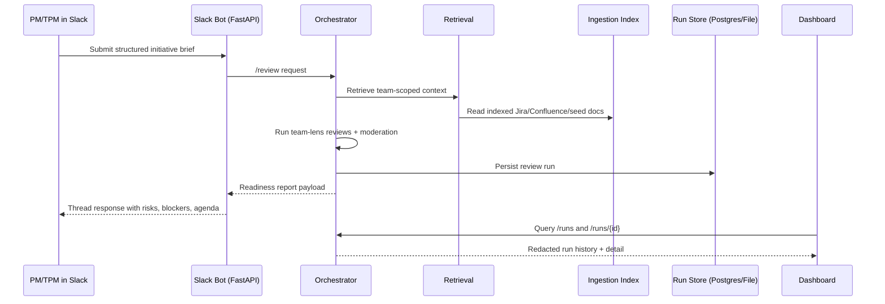
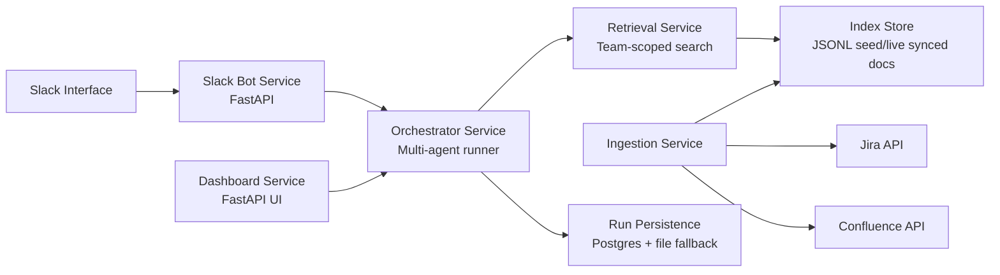

# PreFlight

**PreFlight** is a **Slack-native stakeholder context engine** for **PMs and TPMs**.

It turns **Jira**, **Confluence**, and team context into a structured **readiness review** before kickoff so teams start with decisions, not discovery.

## PRD Snapshot

| Field | Value |
|---|---|
| Product | **PreFlight** |
| Stage | **MVP** (implemented, pilot-ready locally) |
| Primary users | **PMs, TPMs** |
| Secondary users | Engineering, QA, Design, Support, GTM, Security/Privacy leads |
| Core job | **Pressure-test initiative readiness before kickoff** |
| Primary interface | **Slack** |
| Core output | **Readiness signal + blockers + owner map + kickoff agenda** |

## The Story

Kickoff meetings often waste time because critical context is scattered across Jira tickets, Confluence pages, and team notes.

PreFlight fixes that flow.

A PM submits a structured brief in Slack. PreFlight runs role-based stakeholder reviews, retrieves scoped context, labels confidence, and returns a decision-ready report.

## Problem

Pre-kickoff context gathering is slow and inconsistent:
- **Blockers** surface late.
- **Dependencies** appear after planning starts.
- **Ownership** is unclear.
- PM/TPM time is spent chasing context, not driving decisions.

## Product Thesis

Stakeholder risk patterns are role-specific and repeatable. A **multi-agent**, **evidence-aware** review layer can surface risk earlier and improve kickoff quality.

## What PreFlight Produces

- **Readiness status**: `green`, `yellow`, `red`
- **Team-specific risks and blockers**
- **Evidence labels** per concern:
  - `evidence-backed`
  - `inferred`
  - `needs confirmation`
- **Questions to resolve before kickoff**
- **Suggested owner map**
- **Recommended first-meeting agenda**
- **Persisted run history** with dashboard drilldown

## End-to-End Workflow



## Team Lenses + Jira/Confluence Integration

Each lens uses scoped policy (`focus_areas`, `preferred_sources`, `retrieval_hints`) and pulls role-relevant context from **Jira** and **Confluence**.

| Team Lens | Review Focus | Jira/Confluence Usage |
|---|---|---|
| Engineering | feasibility, dependencies, ownership, constraints | Jira epics/issues + Confluence architecture/decision docs |
| QA | regression risk, coverage, release readiness | Jira bug/test issues + Confluence QA runbooks |
| Design | UX ambiguity, flows, edge cases | Jira design tasks + Confluence product/design specs |
| Support | customer impact, escalation readiness | Jira support tasks + Confluence support playbooks |
| GTM | launch timing, messaging dependencies | Jira launch tasks + Confluence launch/messaging docs |
| Security/Privacy | data handling, permissions, compliance | Jira review tickets + Confluence policy/privacy docs |
| TPM | sequencing, owner map, timeline risk | Jira dependency view + Confluence program/release plans |

## Technical Architecture



## Tech Stack (End-to-End)

### Product Surfaces
- Slack bot endpoints for command/event intake and thread response delivery
- Web dashboard for run history, filters, and evidence drilldown

### Backend Services
- **FastAPI** services: `slack-bot`, `orchestrator`, `dashboard`
- **Uvicorn** runtime
- Shared typed contracts via **Pydantic** schemas

### AI and Orchestration
- Role-based multi-agent review flow
- Deterministic fallback mode for demos/tests
- LLM mode via **OpenAI Chat Completions API**
- Moderator synthesis for unified readiness output
- Versioned prompt templates + team policies

### Retrieval and Context
- Team-scoped retrieval with source visibility filtering
- Token-overlap ranking over indexed context (current MVP)
- Evidence excerpts attached to concerns

### Ingestion and Integrations
- **Jira connector** with incremental sync checkpoints
- **Confluence connector** with incremental sync checkpoints
- Seed/dump JSON ingestion path for pilots
- Sync command for live-source refresh

### Data and Persistence
- **Postgres** (local `pgvector` image)
- File fallback run store
- Run history APIs: `/runs`, `/runs/{id}`, dashboard aggregate endpoints

### Security and Reliability
- Optional bearer-token protection for run-history APIs (`PREFLIGHT_HISTORY_API_TOKEN`)
- Redacted run-history payloads by default
- Timeout, retry, and fallback review handling

### Dev and Ops
- **Docker Compose** for local Postgres + Redis
- **Makefile** workflows (`dev-up`, `run-local-stack`, `eval-pilot`)
- `unittest` test suite
- Pilot evaluation gate: `--min-evidence-ratio`

## Structured Slack Brief Format

```text
title: ...
problem: ...
solution: ...
timeline: ...
teams: engineering, qa, design, support, gtm, security_privacy, tpm
metric: ...
constraints: ...
```

Aliases:
- `security/privacy`, `security`, `privacy`, `sec` -> `security_privacy`

## Local Pilot Run

1. `make dev-up`
2. `make check-persistence`
3. `make run-local-stack`
4. `make seed-pilot`
5. `make eval-pilot`

Optional signoff gate:
- `EVAL_MIN_EVIDENCE_RATIO=0.30 make eval-pilot`

## Success Criteria

- Lower PM/TPM pre-kickoff context-gathering time
- Earlier blocker/dependency detection
- Improving `evidence-backed` concern ratio
- Output quality high enough to shape kickoff agendas

## Repo Layout

- `apps/slack-bot`: Slack intake and response delivery
- `apps/dashboard`: run history and drilldown UI
- `services/orchestrator`: orchestration, moderation, run APIs
- `services/retrieval`: context retrieval
- `services/ingestion`: Jira/Confluence/seed ingestion and sync
- `packages/schemas`: shared typed contracts
- `packages/agent-prompts`: role-specific prompt templates
- `docs`: architecture, scope, action items, runbooks

## Positioning

PreFlight is **not** a generic chatbot.

It is an **async pre-kickoff intelligence layer** for product execution: identify risk earlier, align owners faster, and run decision-ready kickoff meetings.
