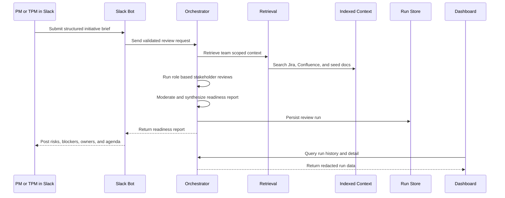
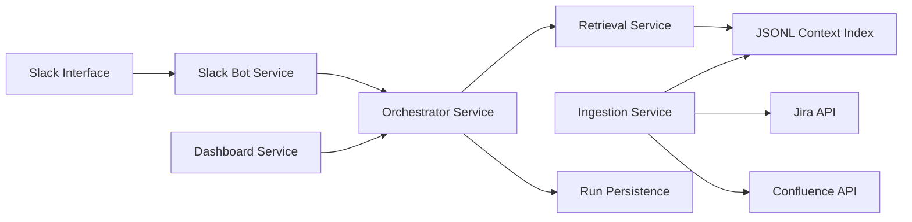

# PreFlight

**AI stakeholder intelligence for PM and TPM kickoff readiness.**

PreFlight is a Slack based AI workflow system that helps Product Managers and Technical Program Managers pressure test initiatives before kickoff.

A PM submits a structured initiative brief in Slack. PreFlight reviews the initiative through role based stakeholder lenses, retrieves relevant Jira and Confluence context, labels concerns by evidence quality, and returns a readiness report with risks, blockers, owners, unresolved questions, and a first meeting agenda.

The goal is simple: help teams spend kickoff meetings making decisions instead of discovering obvious context.

---

## Why I Built This

Kickoff meetings often fail before they start.

PMs and TPMs are expected to walk into cross functional discussions with context from engineering, QA, design, support, GTM, security, privacy, roadmaps, release plans, Jira issues, and Confluence docs. That context usually lives across fragmented systems and people.

Common failure modes:

- Blockers surface after alignment has already started
- Dependencies are discovered late
- Ownership is unclear
- QA, support, GTM, or privacy risks are missed until close to launch
- The first meeting becomes a discovery session instead of a decision session

PreFlight is designed as a pre kickoff intelligence layer for product execution.

---

## Product Thesis

Stakeholder risk patterns are role specific and repeatable.

Engineering evaluates feasibility and ownership. QA evaluates regression risk and coverage. Security and privacy evaluate data handling and compliance. TPMs evaluate sequencing, dependencies, and launch readiness.

PreFlight turns those perspectives into a structured AI review workflow.

It is not a generic chatbot. It is an AI assisted stakeholder review system built around real PM and TPM execution patterns.

---

## What PreFlight Does

PreFlight produces a structured readiness report before kickoff:

- Readiness status: `green`, `yellow`, or `red`
- Team specific risks and blockers
- Evidence labels for every concern
- Questions to resolve before kickoff
- Suggested owner map
- Recommended first meeting agenda
- Persisted run history with dashboard drilldown

Evidence labels:

- `evidence-backed`: supported by retrieved Jira, Confluence, or seed context
- `inferred`: reasonable risk inferred from the initiative and stakeholder lens
- `needs confirmation`: important concern that requires human validation

---

## Example Slack Brief

```text
title: Mobile onboarding redesign
problem: New users are dropping during account setup.
solution: Redesign the first-run onboarding flow and simplify account creation.
timeline: Target beta in 4 weeks, production launch in 8 weeks.
teams: engineering, qa, design, support, gtm, security_privacy, tpm
metric: Increase onboarding completion by 15%.
constraints: Must not delay the current mobile release train.
```

Supported teams:

```text
engineering, qa, design, support, gtm, security_privacy, tpm
```

Supported aliases:

```text
security/privacy, security, privacy, sec -> security_privacy
```

---

## Example Output

```text
Readiness: YELLOW

Summary:
The initiative is promising, but kickoff should not proceed until release sequencing, QA coverage, and privacy ownership are clarified.

Top Risks:
1. Engineering has an active dependency on the mobile auth refactor.
   Evidence: Jira roadmap item references account setup migration.
   Label: evidence-backed

2. QA capacity may be constrained during the proposed beta window.
   Evidence: Release calendar shows regression testing overlap.
   Label: evidence-backed

3. Privacy review is likely needed because onboarding collects account and device metadata.
   Evidence: Inferred from initiative brief and prior privacy review policy.
   Label: inferred

Questions Before Kickoff:
1. Can onboarding changes ship independently from the auth refactor?
2. Who owns privacy review signoff?
3. Is beta scope limited to UI changes or does it include backend account flow changes?

Suggested Owners:
Engineering: Mobile platform lead
QA: Release QA lead
Security/Privacy: Privacy reviewer
TPM: Release coordination owner

Recommended Kickoff Agenda:
1. Confirm scope and success metric
2. Resolve auth dependency and release sequencing
3. Confirm QA coverage
4. Assign privacy review owner
5. Lock beta readiness criteria
```

---

## System Workflow



---

## Architecture



---

## Implemented MVP

### Product Surface

- Slack command and event intake
- Structured initiative brief parsing
- Field validation and team normalization
- Thread response formatting
- Web dashboard for run history and review drilldown

### AI and Orchestration

- Role based multi agent review flow
- Team lenses for engineering, QA, design, support, GTM, security/privacy, and TPM
- Deterministic fallback mode for local demos and tests
- LLM driven mode using OpenAI Chat Completions
- Moderator synthesis for unified readiness output
- Timeout, retry, and fallback handling

### Retrieval and Context

- Team scoped retrieval with source visibility filtering
- Lightweight token overlap ranking over indexed context
- Evidence excerpts attached to concerns
- Source normalized context model for Jira, Confluence, and seed docs

### Integrations

- Jira API ingestion
- Confluence API ingestion
- Local JSON seed ingestion for pilots and demos
- Checkpointed incremental sync for live sources

### Data, Security, and Reliability

- Shared Pydantic schemas across services
- Run persistence with history APIs
- Dashboard aggregate endpoint
- Redacted run history by default
- Optional bearer token protection for history APIs through `PREFLIGHT_HISTORY_API_TOKEN`
- Observability events for review runs

### Dev and Evaluation

- Makefile workflows for local development
- Syntax check and unittest suite
- Pilot seed data flow
- Pilot evaluation script with evidence ratio threshold

---

## Tech Stack

- **Backend:** Python, FastAPI, Uvicorn
- **Schemas:** Pydantic
- **AI:** OpenAI Chat Completions API, prompt policies, deterministic fallback runner
- **Integrations:** Slack, Jira API, Confluence API
- **Retrieval:** Team scoped JSONL index with token overlap ranking
- **Persistence:** Postgres capable run store with file fallback
- **Dashboard:** FastAPI served web UI
- **DevOps:** Makefile workflows, local stack scripts, unittest

---

## Local Run

```bash
make dev-up
make check-persistence
make run-local-stack
make seed-pilot
make eval-pilot
```

Optional pilot signoff gate:

```bash
EVAL_MIN_EVIDENCE_RATIO=0.30 make eval-pilot
```

---

## Repository Layout

```text
apps/
  slack-bot/        Slack intake, validation, and response delivery
  dashboard/        Run history UI and dashboard APIs

services/
  orchestrator/     Multi agent execution, moderation, run APIs
  retrieval/        Team scoped context retrieval
  ingestion/        Jira, Confluence, seed ingestion, and sync

packages/
  schemas/          Shared contracts for briefs, reviews, evidence, and runs
  agent-prompts/    Role specific prompt templates and team policies

docs/               Architecture notes, scope, action items, and runbooks
scripts/            Local development, seeding, sync, and pilot evaluation
```

---

## Why This Matters for Product Teams

PreFlight targets a real operating problem: the cost of low quality kickoff preparation.

For PMs, it reduces manual context gathering and surfaces sharper stakeholder questions.

For TPMs, it highlights sequencing risk, unclear ownership, and launch readiness gaps.

For cross functional teams, it turns kickoff from a discovery meeting into a decision meeting.

---

## Product Management Signals Demonstrated

This project demonstrates:

- Identifying a real PM and TPM workflow pain point
- Scoping an AI native MVP around a narrow user job
- Designing structured intake and output workflows
- Modeling cross functional stakeholder perspectives
- Balancing LLM reasoning with evidence labeling and validation
- Integrating AI into existing enterprise tools instead of creating another destination app
- Building evaluation hooks for output quality and evidence coverage
- Thinking through trust, security, redaction, and auditability

---

## Resume Positioning

**Product Management:**

> Built PreFlight, a Slack based AI stakeholder intelligence tool that helps PMs and TPMs pressure test initiatives before kickoff using Jira, Confluence, role based agents, and evidence labeled readiness reports.

**Technical Product Management:**

> Architected an AI assisted TPM workflow across Slack intake, Jira/Confluence ingestion, scoped retrieval, multi agent orchestration, moderator synthesis, run persistence, redacted history APIs, and dashboard drilldown.

**AI Product:**

> Designed an evidence aware multi agent review system that separates source backed blockers from inferred risks and unresolved questions to improve trust in AI generated product recommendations.

---

## Current Status

PreFlight is implemented as a local MVP and public portfolio project.

It includes Slack intake, structured validation, role based stakeholder reviews, LLM and deterministic review modes, Jira and Confluence ingestion, scoped retrieval, evidence labeling, run persistence, dashboard drilldown, and pilot evaluation support.

Future upgrades could include semantic vector retrieval, richer permission mapping, production Slack OAuth, deeper Jira dependency graph analysis, support tool ingestion, and real team pilot feedback loops.

---

## One Line Pitch

**PreFlight helps PMs and TPMs enter kickoff with risks, blockers, owners, and sequencing questions already mapped by AI.**
